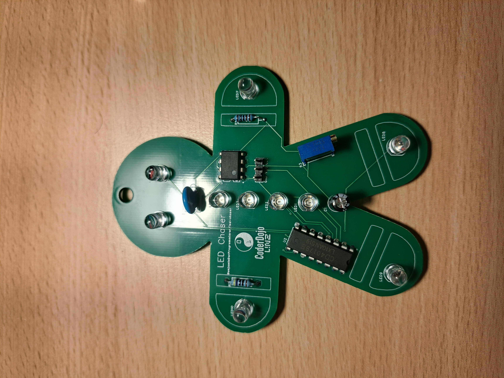

# LED Chaser

## Description

A circuit that blinks LEDs one after another. (see [this tutorial](https://blueprint.hackclub.com/starter-projects/blinky)). i chose the design of a gingerbread man (Because Christmas is near)
